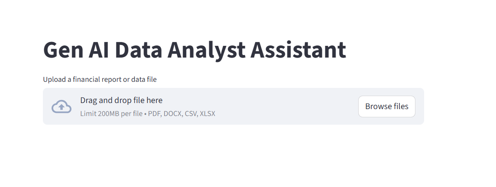

# 📊 Gen AI Data Analyst Assistant  

## 🚀 Overview  
Gen AI Data Analyst Assistant is an **interactive web application** that empowers users to **upload, summarize, visualize, and query datasets** — leveraging advanced **LLMs** and automated dashboards.  

It is designed for professionals, students, and businesses who want quick insights into their data without writing complex queries. Perfect for **financial reports, CSV/Excel data, and business analytics**.  

---

## ✨ Features  
- 📂 **Upload files**: Supports CSV, Excel, PDF, and DOCX formats.  
- 🤖 **AI-powered summary**: Generates concise, business-ready summaries using **GenAI via OpenRouter**.  
- 📊 **Automated dashboard**: Visualizes descriptive statistics, top categories, and trends.  
- 💬 **Interactive Q&A**: Ask questions about your data — answers powered by LLMs.  
- 🛠️ **Modular design**: Clean separation of ingestion, analytics, dashboard, and QA for extensibility.  

---

## 🎥 Demo  
  
*(Replace with actual screenshot or GIF of the app in action)*  

---

## 🏗️ Architecture  
File Upload → Preprocessing → AI Summary → Dashboard → Q&A

yaml
---

## 🔧 How to Use  

### 1. Clone this repo  
```bash
git clone https://github.com/yourusername/gen-ai-data-analyst-assistant.git
cd gen-ai-data-analyst-assistant
2. Install dependencies
bash
pip install -r requirements.txt
3. Add your API key
Copy .env.example to .env and add your OpenRouter key:
text
OPENAI_API_KEY=sk-or-xxxxxxxxxxxxxxxxxxxxx
4. Run the app
bash
streamlit run app.py
✅ Now upload a data file and explore summaries, dashboards, and Q&A!

🛠️ Tech Stack
Python, Pandas

Streamlit

OpenAI / OpenRouter API

Modular architecture:

src/preprocessing → Data ingestion & cleaning

src/genai → AI summary & QnA module

src/dashboard → Visualization & analytics

src/feedback → Feedback & improvements

💡 Use Cases
📊 Financial report analysis

🏥 Healthcare records insights

🛒 Sales & marketing trends

🎓 Academic datasets

